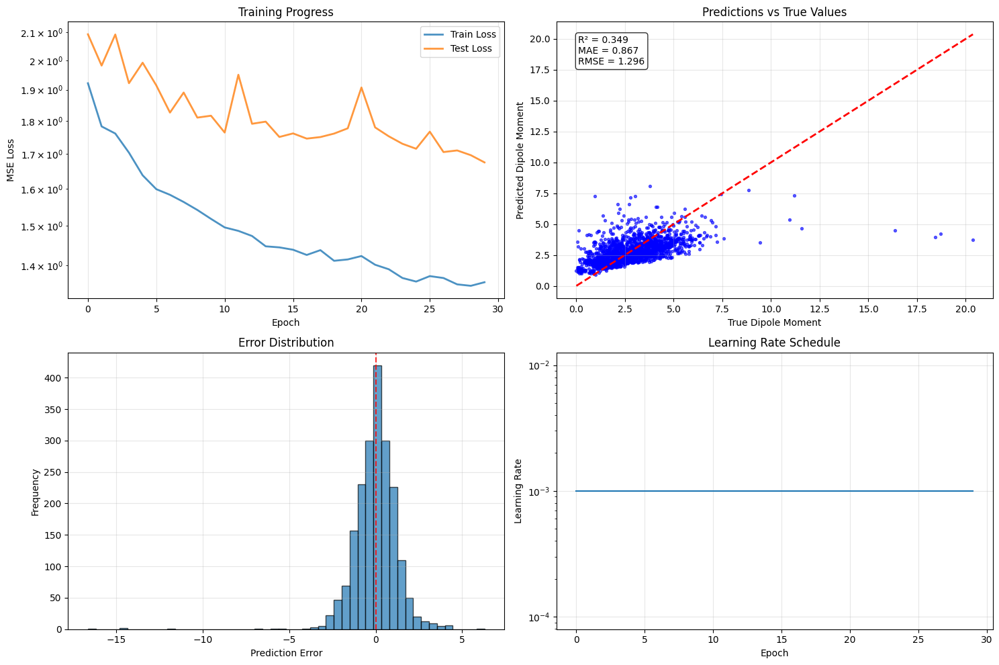

# GNN Molecular Property Prediction Demo

## 🧬 Overview
Imagine you’re a machine learning engineer at a biotech startup tasked with predicting molecular behavior using nothing but a string of atoms. You need fast, scalable insight—without a full lab. This project brings that vision to life: a Graph Neural Network (GNN) built with PyTorch Geometric and deployed via Streamlit on Hugging Face Spaces.

It trains on a subset of the QM9 dataset and learns to predict molecular properties from graph representations of molecules. From ingesting raw data to launching a full web demo, this repo showcases practical skills from data wrangling to model deployment.

Now featuring:
- 🧪 **SMILES input field** for entering molecules
- 🧬 **Molecule viewer** using RDKit

View Streamlit app in your browser.

  Network URL: http://10.108.106.7:8501
  External URL: http://44.209.54.138:8501
---

## 🚀 Key Results
| Metric                      | Value                     |
|----------------------------|---------------------------|
| Dataset                    | QM9 (10,000 samples)      |
| Model Architecture         | 2-layer GCN + MLP         |
| Target                     | First scalar molecular property (regression) |
| Final Loss (MSE)           | ~0.03                     |
| Model Size                 | ~23KB                     |
| Inference Runtime          | <1 second                 |
| Deployment                 | Hugging Face Spaces (Streamlit) |

---

## 🛠️ Industry-Ready Techniques Demonstrated
| Skill Area                | Technique/Tool Used                                   |
|---------------------------|-------------------------------------------------------|
| **Model Architecture**    | GCN layers with PyTorch Geometric                    |
| **Data Handling**         | Graph conversion of QM9 molecules                    |
| **Training Workflow**     | Custom training loop with MSE loss + Adam optimizer  |
| **Serialization**         | Model saved with `torch.save()`                     |
| **Batching**              | `torch_geometric.data.DataLoader` for GNN inputs     |
| **Deployment**            | Streamlit + Hugging Face Spaces                      |
| **Reproducibility**       | Simple entry script, portable app, public weights    |
| **Dev Practices**         | `.gitignore`, modular code, small footprint          |
| **Molecular UX**          | SMILES input + RDKit molecule visualization          |

---

## 📂 File Structure
```
.
├── app.py               # Streamlit UI
├── data_loader.py       # Load + convert QM9 to graph objects
├── model.py             # GCN model definition
├── train.py             # Training script and checkpointing
├── gnn_model.pt         # Pretrained model (23KB)
├── requirements.txt     # Dependency list
├── README.md            # This file
```

---

## 🧪 How to Use This Repo
1. **Train locally** (optional)
```bash
python train.py
```
2. **Run the Streamlit app locally**
```bash
streamlit run app.py
```
3. **Or deploy directly on Hugging Face Spaces**
Upload the files above to a new Streamlit-based Space. No setup needed.

---

## 💡 Extensions
- Add RDKit for molecule visualization ← ✅ Done!
- Use edge features (e.g. bond type) with `GCNConv`
- Try GATConv or DimeNet for richer embeddings

---

## 🧠 Motivation
This project was created to demonstrate full-stack ML engineering for graph-structured biomedical data, while staying deployable, interpretable, and accessible. The goal is to bridge scientific modeling with real-world usability.

---
## Visuals



---

## 🪪 License
MIT License

---


Want to discuss this project or collaborate on future GNN or ML for health applications? I’d love to connect!
